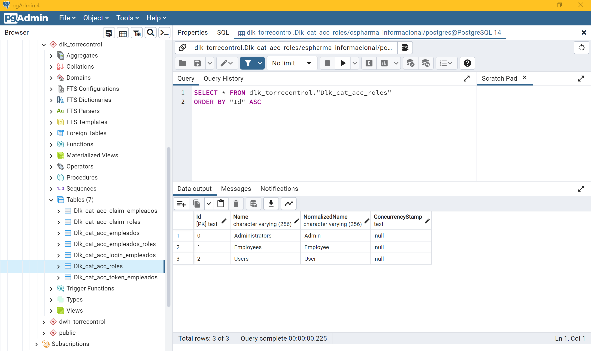
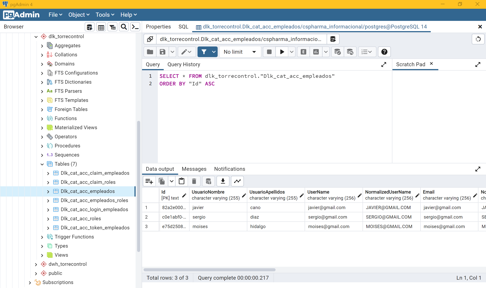
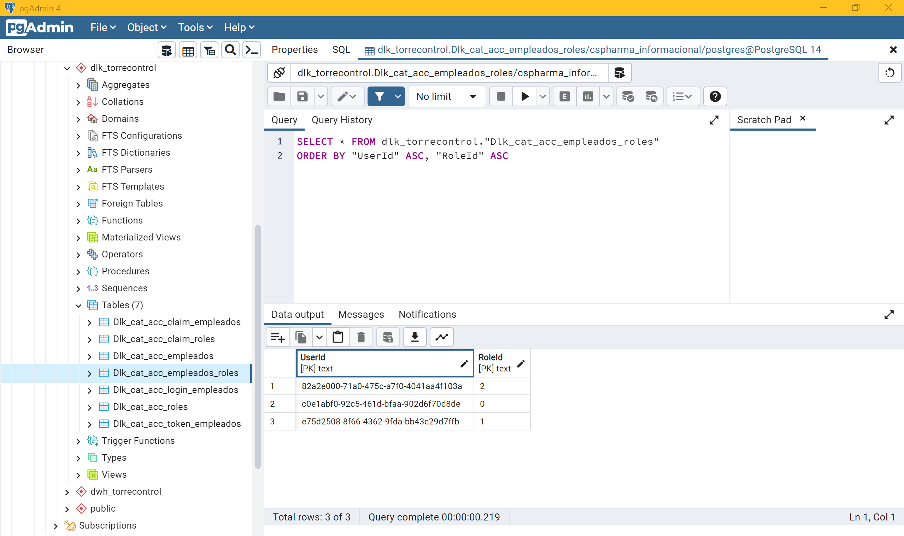
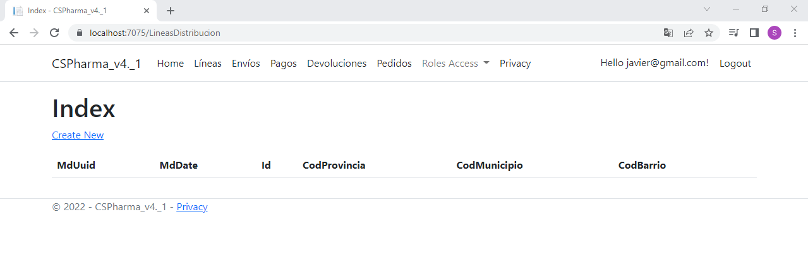

# CSPharma-v4.2.1

- [CSPharma-v4.2.1](#cspharma-v421)
  - [Introducción](#introducción)
  - [Historial de commits](#historial-de-commits)
  - [Enlace a Trello - tablero del sprint 2](#enlace-a-trello---tablero-del-sprint-2)
- [1. Ocultar botones del navbar](#1-ocultar-botones-del-navbar)
- [2. Restringir acceso a usuarios no identificados](#2-restringir-acceso-a-usuarios-no-identificados)
- [3. Creación de roles en la BBDD](#3-creación-de-roles-en-la-bbdd)
  - [3.1. Añadir roles](#31-añadir-roles)
  - [3.2. Añadimos tres usuarios desde la vista (ejecución programa)](#32-añadimos-tres-usuarios-desde-la-vista-ejecución-programa)
  - [3.3. Relacionamos esos usuarios con cada uno de los roles](#33-relacionamos-esos-usuarios-con-cada-uno-de-los-roles)
- [4. Restringir el acceso a las vistas según el rol del usuario identificado](#4-restringir-el-acceso-a-las-vistas-según-el-rol-del-usuario-identificado)
    - [User.cshtml](#usercshtml)
    - [User.cshtml.cs](#usercshtmlcs)
    - [Employee.cshtml](#employeecshtml)
    - [Employee.cshtml.cs](#employeecshtmlcs)
    - [Admin.cshtml](#admincshtml)
    - [Admin.cshtml.cs](#admincshtmlcs)
    - [Program.cs](#programcs)
- [5. Ocultar una parte concreta de una vista según un rol](#5-ocultar-una-parte-concreta-de-una-vista-según-un-rol)
- [Actualizaciones del proyecto](#actualizaciones-del-proyecto)
  - [Re-Migration - Cambiando los nombres por defecto de las tablas de Scaffold-Identity](#re-migration---cambiando-los-nombres-por-defecto-de-las-tablas-de-scaffold-identity)
  - [Frontend - Diseño del Login, Register, Home y Navbar](#frontend---diseño-del-login-register-home-y-navbar)

## Introducción

Continuando con la práctica anterior, tras añadir con Scaffold-Identity todas las funcionalidades del login/register del usuario (empleado), y haber migrado a la base de datos un nuevo esquema llamado "dlk_torrecontrol" con las tablas de Scaffold; vamos a continuar ahora añadiendo roles de usuario, y aprenderemos a crearlos y asignarlos, así como mostrar de forma más protegida el contenido de nuestra web.

**Nota**: Esto es la continuación de la v4.2.0

**Nota**: Recuerda que había actualizado el repositorio de la versión anterior (v4.2.0) para cambiar los nombres por defecto de las tablas que crea Scaffold, haciendo uso del ModelBuilder (fluent API) en la clase del contexto.

## Historial de commits

[Ver el historial de commits del repositorio](https://github.com/csi21-sdiapos/CSPharma-v4.2.1/commits)

## Enlace a Trello - tablero del sprint 2

[Enlace a Trello para unirte como miembro a mi tablero del Sprint 2](https://trello.com/invite/b/iD6WViCT/ATTI5a3120080f6ba073d91b37fa537c9b7d62ABE030/cspharma-v41)

# 1. Ocultar botones del navbar

Primeramente, vamos a probar a ocultar botones del navbar para usuarios que no estén identificados,. Vamos al *_Layout.cshtml.cs* para añadir lo siguiente (probamos a ocultar el Privacy)

```html
@if (User.Identity.IsAuthenticated){
    <li class="nav-item">
        <a class="nav-link text-dark" asp-area="" asp-page="/Privacy/Privacy">Privacy</a>
    </li>
}
```


# 2. Restringir acceso a usuarios no identificados

Para restringir el acceso a cualquiera de nuestras secciones, tan sólo tenemos que ir al controlador de la vista en cuestión, y ponerle la etiqueta [Authorize] a la cabecera de la definición de la clase.

Por ejemplo, vamos a restringir el acceso a todas nuestras vistas (las index) a cualquier usuario que no esté identificado.

```csharp
namespace CSPharma_v4._1.Pages.LineasDistribucion
{
    [Authorize]
    public class IndexModel : PageModel
    { ... }
}
```


# 3. Creación de roles en la BBDD

Tenemos que ir a nuestro esquema *dlk_torrecontrol*, y a la tabla de *AspNetRoles*, y manualmente en pgAdmin creamos tres roles.

## 3.1. Añadir roles 



**Nota**: también puedes añadir roles definiendo consultas inserts en el archivo de una nueva migración, en el método Up(), añadiéndole como parámetro de entrada un objeto de la clase MigrationBuilder y utilizando su método .sql() para definir cualquier query y ejecutar éstas en el momento en que empujes la migración hacia la BBDD... https://csharp.hotexamples.com/es/examples/-/MigrationBuilder/Sql/php-migrationbuilder-sql-method-examples.html

## 3.2. Añadimos tres usuarios desde la vista (ejecución programa)



## 3.3. Relacionamos esos usuarios con cada uno de los roles



- Sergio --> Admin (0)

- Moises --> Employee (1)

- Javier --> User (2)

**Nota**: las contraseñas (normales desencriptadas) de estos usuarios de prueba es la misma (Abc123!).

# 4. Restringir el acceso a las vistas según el rol del usuario identificado

Para hacer esto, primero vamos a crear una nueva carpeta en Pages, llamada Roles. Dentro de ella vamos a crear tres vistas: User, Employee y Admin. Y a cada uno le agregamos un controlador con la issolation.

**Nota**: por issolation me refiero al hecho de agregar un archivo (en este caso un controlador) poniéndole el mismo nombre que su vista, pero con la extensión del tipo de archivo del que se trate... por ejemplo, en este caso, quiero agregar un controlador a la vista User.cshtml, pues agrego un archivo que se llame User.cshtml.cs y automáticamente se relacionan entre sí.

Date cuenta que en el controlador, tenemos que cambiar la herencia de :Controller a :PageModel, y que el método IActionResultIndex() devuelva una Page() en vez de una View().

### User.cshtml

```html
@page
@model CSPharma_v4._1.Pages.Roles.User

@{
    ViewData["Title"] = "Roles Page";
}

<h1>UserNotConfirmed Page</h1>
```

### User.cshtml.cs

```csharp
using Microsoft.AspNetCore.Authorization;
using Microsoft.AspNetCore.Mvc;
using Microsoft.AspNetCore.Mvc.RazorPages;

namespace CSPharma_v4._1.Pages.Roles
{
    [Authorize(Roles = "Users")]
    public class User : PageModel
    {
        public IActionResult Index()
        {
            return Page();
        }
    }
}
```

### Employee.cshtml

```html
@page
@model CSPharma_v4._1.Pages.Roles.Employee

@{
    ViewData["Title"] = "Roles Page";
}

<h1>Employee Page</h1>
```

### Employee.cshtml.cs

```csharp
using Microsoft.AspNetCore.Authorization;
using Microsoft.AspNetCore.Mvc;
using Microsoft.AspNetCore.Mvc.RazorPages;

namespace CSPharma_v4._1.Pages.Roles
{
    [Authorize(Roles = "Employees")]
    public class Employee : PageModel
    {
        public IActionResult Index()
        {
            return Page();
        }
    }
}
```

### Admin.cshtml

```html
@page
@model CSPharma_v4._1.Pages.Roles.Admin

@{
    ViewData["Title"] = "Roles Page";
}

<h1>Admin Page</h1>
```

### Admin.cshtml.cs

```csharp
using Microsoft.AspNetCore.Authorization;
using Microsoft.AspNetCore.Mvc;
using Microsoft.AspNetCore.Mvc.RazorPages;
using System.Data;

namespace CSPharma_v4._1.Pages.Roles
{
    [Authorize(Roles = "Administrators")]
    public class Admin : PageModel
    {
        public IActionResult Index()
        {
            return Page();
        }
    }
}
```

### Program.cs

Ahora ya tan sólo tenemos que añadir el servicio que activa los roles.

```csharp
builder.Services.AddDefaultIdentity<UserAuthentication>(options => options.SignIn.RequireConfirmedAccount = false)
    .AddRoles<IdentityRole>()
    .AddEntityFrameworkStores<LoginRegisterContext>();
```

Si ahora hacemos una prueba, y nos identificamos como el usuario de Javier (el cual es un tipo (2) que representa el rol de usuario normal), e intentamos acceder a la vista del Admin... comprobamos que efectivamente se nos deniega el acceso a esta vista, pero en cambio si intentamos acceder a la vista del User, vemos que sí nos deja acceder perfectamente.


# 5. Ocultar una parte concreta de una vista según un rol

Vamos a hacer un ejemplo con la sección de LineasDistribucion, en su vista Index.

Primero vamos al controlador de Index.cshtml.cs para indicar que sólo podrán acceder a esta vista los roles de Users y Administrators

```csharp
namespace CSPharma_v4._1.Pages.LineasDistribucion
{
    [Authorize(Roles = "Users, Administrators")]
    public class IndexModel : PageModel
    { ... }
}
```

Y ahora vamos a la vista de Index.cshtml para especificar que el <tbody> donde se devuelve la lista de objetos de LineasDistribucion, sólo pueda ser visto por el rol Administrator

```html
@if (User.IsInRole("Administrators")){
        <tbody>
            @foreach (var item in Model.TdcCatLineasDistribucion)
            {
                <tr>
                    <td>
                        @Html.DisplayFor(modelItem => item.MdUuid)
                    </td>
                    <td>
                        @Html.DisplayFor(modelItem => item.MdDate)
                    </td>
                    <td>
                        @Html.DisplayFor(modelItem => item.Id)
                    </td>
                    <td>
                        @Html.DisplayFor(modelItem => item.CodProvincia)
                    </td>
                    <td>
                        @Html.DisplayFor(modelItem => item.CodMunicipio)
                    </td>
                    <td>
                        @Html.DisplayFor(modelItem => item.CodBarrio)
                    </td>
                    <td>
                        <a asp-page="./Edit" asp-route-id="@item.CodLinea">Edit</a> |
                        <a asp-page="./Details" asp-route-id="@item.CodLinea">Details</a> |
                        <a asp-page="./Delete" asp-route-id="@item.CodLinea">Delete</a>
                    </td>
                </tr>
            }
        </tbody>
    }
```

Hacemos una prueba, y primero accedemos como Sergio, que tiene el rol de Administrator... y comprobamos que efectivamente podemos ver la lista de objetos de LineaDistribucion.


Y si ahora probamos a acceder como Javier, que tiene el rol de Users... comprobamos que no podemos ver nada ya que no nos aparece la lista de objetos.



# Actualizaciones del proyecto

## Re-Migration - Cambiando los nombres por defecto de las tablas de Scaffold-Identity

[Prueba de ejecición de roles después de haber rehecho la migración y cambiado los nombres de las tablas de la BBDD](https://github.com/csi21-sdiapos/CSPharma-v4.2.1/issues/2)

## Frontend - Diseño del Login, Register, Home y Navbar

[Prueba de ejecución para ver el frontend del login, el register y el home](https://github.com/csi21-sdiapos/CSPharma-v4.2.1/issues/3)